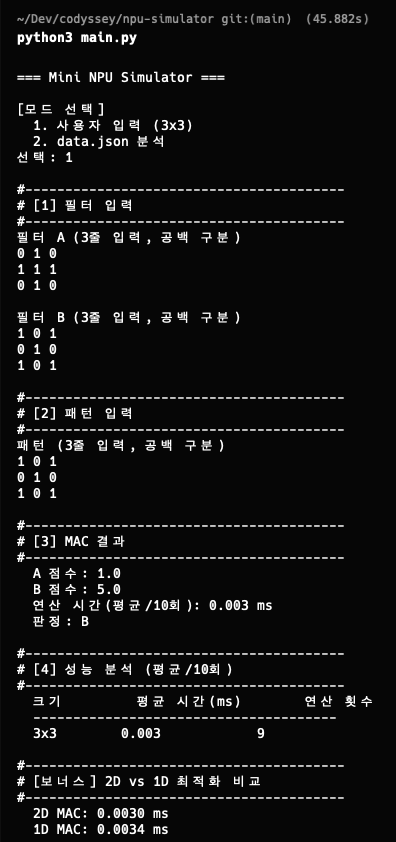

# Mini NPU Simulator

MAC(Multiply-Accumulate) 연산을 통해 2차원 패턴을 판별하는 시뮬레이터입니다. 십자가(Cross)와 X 패턴을 필터와 비교하여 유사도를 계산하고, AI 전용 칩(NPU)의 핵심 연산 원리를 직접 구현합니다.

## 실행 방법

```bash
# Python 3.8 이상 필요
python3 main.py
```

실행 후 모드를 선택합니다:
- **모드 1**: 3×3 필터 2개와 패턴을 직접 입력하여 MAC 연산 수행
- **모드 2**: `data.json`에서 필터(5×5, 13×13, 25×25)와 패턴을 로드하여 일괄 분석

`data.json`은 프로젝트 루트에 위치해야 합니다.

### 실행 환경

| 항목 | 버전 |
|------|------|
| Python | 3.8+ |
| OS | macOS / Linux / Windows |
| 외부 라이브러리 | 없음 (표준 라이브러리만 사용) |

## 구현 요약

### 파일 구조

```
npu-simulator/
├── main.py          # 메인 실행 파일 (모드 1/2, 입출력 처리)
├── npu_core.py      # MAC 연산 엔진, 라벨 정규화, 검증, 패턴 생성기
├── data.json        # 테스트 데이터 (필터 + 패턴 + expected)
├── .gitignore
└── README.md
```

### MAC 연산 구현

MAC(Multiply-Accumulate)은 입력 패턴과 필터를 같은 위치끼리 곱한 뒤 모든 값을 더하는 연산입니다.

```python
def mac(pattern, filt):
    total = 0.0
    for row_p, row_f in zip(pattern, filt):
        for val_p, val_f in zip(row_p, row_f):
            total += val_p * val_f
    return total
```

- 외부 라이브러리(NumPy 등) 없이 이중 반복문으로 직접 구현
- n×n 배열에 대해 정확히 n² 번의 곱셈과 덧셈 수행

### 라벨 정규화

프로그램 내부에서 표준 라벨 2가지를 사용합니다: **Cross**, **X**

| 입력 값 | 정규화 결과 |
|---------|------------|
| `+`, `cross`, `Cross`, `CROSS` | `Cross` |
| `x`, `X` | `X` |

`data.json`의 expected 값(`+`, `x`)과 필터 키(`cross`, `x`)를 모두 표준 라벨로 변환한 뒤 비교합니다. 이를 통해 데이터 포맷의 불일치 문제를 방지합니다.

### 동점 처리 정책 (epsilon 기반)

```python
EPSILON = 1e-9

def judge(score_cross, score_x):
    if abs(score_cross - score_x) < EPSILON:
        return "UNDECIDED"
    return "Cross" if score_cross > score_x else "X"
```

부동소수점 연산은 IEEE 754 표준의 한계로 인해 정확한 값 비교가 불가능할 수 있습니다. 예를 들어 `0.1 + 0.2 ≠ 0.3`과 같은 오차가 발생합니다. 따라서 두 점수의 차이가 epsilon(1e-9) 미만이면 동점(`UNDECIDED`)으로 판정합니다.

### 입력 검증

- 모드 1: 행/열 개수 불일치, 숫자 파싱 실패 시 안내 메시지 출력 후 재입력 유도
- 모드 2: 필터-패턴 크기 불일치, 키 형식 오류, 필드 누락 시 해당 케이스만 FAIL 처리 (프로그램 비정상 종료 방지)

### 보너스 기능

1. **1차원 최적화**: 2차원 배열을 1차원으로 펼쳐 단일 루프로 MAC 연산 수행. 성능 비교 결과를 함께 출력
2. **패턴 생성기**: `generate_cross(n)`, `generate_x(n)` 함수로 임의 크기의 십자가/X 패턴을 자동 생성. 성능 분석에 활용

## 결과 리포트

### 테스트 결과 요약

| 항목 | 값 |
|------|-----|
| 총 테스트 | 10개 |
| 통과 (PASS) | 9개 |
| 실패 (FAIL) | 1개 |

### FAIL 케이스 원인 분석

**size_13_4: UNDECIDED (동점) → expected: Cross → FAIL**

이 케이스는 의도적으로 Cross 점수와 X 점수가 동일하게 설계된 데이터입니다. 13×13 패턴의 모든 셀에 0.5를 기본값으로 설정하고, 십자가와 X의 교차 위치(가로줄, 세로줄, 대각선)에 동일한 가중치(0.9)를 부여했습니다. 이로 인해 Cross 필터와 X 필터에 대한 MAC 점수가 22.6으로 동일하게 산출됩니다.

epsilon 기반 비교 정책(`abs(score_cross - score_x) < 1e-9`)에 따라 이 차이는 동점으로 판정되어 `UNDECIDED`가 됩니다. expected 값은 `Cross`이므로 FAIL로 처리됩니다.

이 케이스는 "부동소수점 오차"가 아닌 "데이터 설계에 의한 실질적 동점"입니다. 실제 AI 시스템에서도 패턴이 두 클래스의 중간에 위치할 때 발생하는 현실적인 시나리오를 반영합니다. 해결 방안으로는:
- **임계값 조정**: epsilon을 더 큰 값(예: 0.01)으로 설정하면 근소한 차이도 판정에 반영할 수 있지만, 부동소수점 오차를 판정 차이로 오인할 위험이 있습니다.
- **추가 판정 기준**: 동점 시 패턴의 구조적 특징(연결성, 대칭성 등)을 분석하는 2차 판정 로직을 추가할 수 있습니다.
- **데이터 품질 관리**: expected 라벨이 실제 패턴 특성과 정확히 일치하는지 사전 검증하는 파이프라인을 구축할 수 있습니다.

나머지 9개 테스트가 모두 PASS인 이유는:
1. **라벨 정규화**: `+`/`x` → `Cross`/`X` 변환을 통해 expected와 판정 결과의 포맷 불일치 문제를 원천적으로 제거
2. **epsilon 비교**: 부동소수점 오차로 인한 잘못된 판정을 방지
3. **스키마 검증**: 필터/패턴 크기 불일치를 사전에 감지하여 잘못된 연산을 방지

### 시간 복잡도 분석

MAC 연산의 시간 복잡도는 **O(N²)** 입니다. N×N 크기의 패턴과 필터에 대해 정확히 N² 번의 곱셈과 N² 번의 덧셈을 수행하기 때문입니다.

실제 측정 결과:

| 크기 (N×N) | 평균 시간 (ms) | 연산 횟수 (N²) | N² 대비 비율 |
|-----------|---------------|--------------|-------------|
| 3×3 | 0.002 | 9 | 기준 |
| 5×5 | 0.003 | 25 | 2.8x |
| 13×13 | 0.015 | 169 | 18.8x |
| 25×25 | 0.048 | 625 | 69.4x |

연산 횟수와 실측 시간의 증가 추세를 비교하면:
- 3→5: 연산 횟수 2.8배 증가, 시간 약 1.5배 증가
- 3→13: 연산 횟수 18.8배 증가, 시간 약 7.5배 증가
- 3→25: 연산 횟수 69.4배 증가, 시간 약 24배 증가

작은 크기(3×3, 5×5)에서는 Python 인터프리터의 함수 호출 오버헤드와 루프 초기화 비용이 순수 연산 시간보다 상대적으로 크기 때문에 O(N²) 비례 관계가 명확하게 드러나지 않습니다. 그러나 크기가 커질수록(13→25) 시간 증가 비율이 연산 횟수 증가 비율에 수렴하여 O(N²) 복잡도가 확인됩니다.

실제 AI 모델에서는 수백×수백 크기의 필터를 수천 개 사용하므로, 이 O(N²) 연산이 수억 번 반복됩니다. 이것이 CPU의 직렬 처리로는 한계가 있어 NPU와 같은 병렬 처리 전용 하드웨어가 필요한 근본적인 이유입니다.

## 실행 화면

### 모드 1: 사용자 입력 (3x3)



3x3 십자가 필터(A)와 X 필터(B)를 입력한 뒤, X 패턴을 입력하여 MAC 연산을 수행한 결과입니다. B 점수(5.0)가 A 점수(1.0)보다 높아 "판정: B"로 출력됩니다.

### 모드 2: data.json 분석


`data.json`에서 5x5, 13x13, 25x25 필터와 패턴을 로드하여 일괄 분석한 결과입니다. 필터 로드 → 패턴별 PASS/FAIL 판정 → 성능 분석(크기별 평균 시간/연산 횟수) → 2D vs 1D 최적화 비교 → 결과 요약(10개 중 9 PASS, 1 FAIL)까지 전체 과정이 표시됩니다.

---
_이 프로젝트는 codyssey 미션의 일환으로 제작되었습니다._
